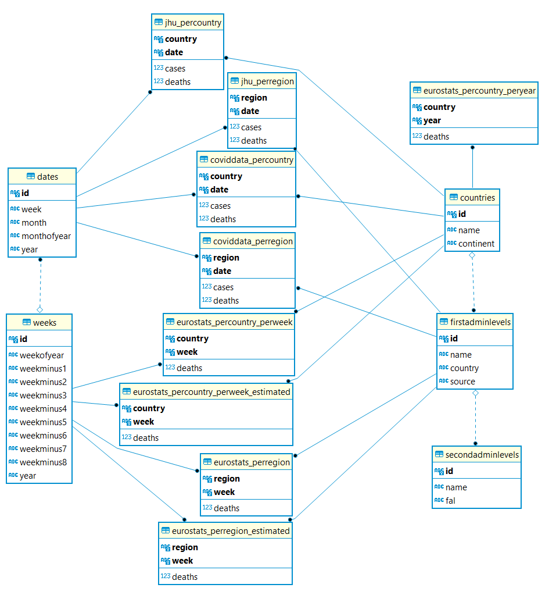

<meta name="robots" content="noindex">

# Discordance measurement using COVID-19 data from JHU and EuroStats
We present a usecase of Eris based on the reported number of deaths due to COVID-19 in each country and region (as in [JHU](https://github.com/CSSEGISandData/COVID-19/tree/master/csse_covid_19_data/csse_covid_19_time_series)) and the overall number of deaths in the corresponding country or region (as in [EuroStats](https://ec.europa.eu/eurostat/databrowser/view/demo_r_mwk2_ts/default/table?lang=en)). The study is done only for six countries (i.e., NL, SE, DE, IT, ES, UK), even if the sources are fully loaded into the database.

To facilitate the integration of the sources, we used the [NUTS](https://ec.europa.eu/eurostat/web/nuts/background) as geographical master data and [COVIDData repository](https://github.com/coviddata/coviddata) as a surrogate to the regional data in JHU.

All the used data as downloaded from the corresponding source (in CSV format) are available in ``COVID data`` folder (files are named with the source, date like ``yymmdd``, and the data contained being either cases or deaths). There is also an empty subfolder ``Error logs`` required for the ETL flows to leave log files while running.

# Setup

* Install [PostgreSQL](https://www.postgresql.org) - v9.6

* Install [Pentaho Data Integration](https://sourceforge.net/projects/pentaho) - v8.3 with JVM 8 (unfortunately, PDI does not support the latest version of Java).

     bash -c "export PENTAHO_JAVA_HOME=***ABSOLUT-PATH-TO-JRE-FOLDER***; sh spoon.sh"
      
     [PostgreSQL JDBC drivers](https://jdbc.postgresql.org) -v42.2.5 should already be in "data-integration/lib".

* Install [GNUPlot](http://www.gnuplot.info) - v5.2
 
     This is only required to generate the line charts as in the paper.
 
# Building

1. Create a database in PostgreSQL.

## R and S ([r_and_s.sql](r_and_s.sql))

This a basic example with two tables to test the parsing and execution of simple queries in the prototype.

# Running

1. Call``spoon.sh`` (or ``Spoon.bat``, depending on the OS).
   1. Go to ``Edit->Set Environment Variables`` and provide the four values for the database connection to PostgreSQL (i.e., database, host, username and password).
1. Launch the ETL flow ``covid_world.kjb`` in Kettle to fill the tables in ``DatabaseSchema.png``

# Code structure

The high level steps in the ETL are:
1. Create all the tables (without integrity constraints).
1. Load the dimensional information.
1. Declare the constraints of the dimensions (i.e., location and time).
1. Load in parallel:
   1. JHU country data,
   1. JHU region data, and
   1. EuroStats data.
1. Declare the constraints of the fact tables.
1. Update all the statistics of the database.

## Schema table creation ([schema.sq](schema.sql))
* The table `schema` should exist in the database that will be used for experiments.  This table has columns
  `tablename`, `fieldname`, `key`, `varfree` and each entry `(t,f,k,v)` represents
  the fact that table `t` has field `f` which is a key (if `k=true`)
  or value (if `k=false`). In the case of a value, it can be declared to be free of variables (if `v=true`), in which case it can be freely multiplied or used as denominator. Tables and fields not mentioned in `schema` will be ignored by the system.

## COVID data

The [ETL](covid_world.kjb) loads the schema above with data from the described sources.
It requires the correspoding CSV files to be available in `COVID data` folder and creates different files under `Error logs` to keep track of ignored rows for one reason or another.  

Some SQL scripts are also provided to facilitate the validation of data once loaded in the database:
* [COVID sources validation of deaths.sql](COVID sources validation of deaths.sql) retrieves descriptive statistics of the fact tables and validations of quality issues in the data comming from EuroStats.
* [COVID sources validation of cases.sql](COVID sources validation of cases.sql) compares the data from JHU at coutry and region levels, and retrieves negative reportings (which is already mitigated by taking the running average of seven days).
* [COVIDCheckJoins.sql](COVIDCheckJoins.sql) checks the correspondences of reported data for Spain in the different sources.
* [COVIDQuery.sql](COVIDQuery.sql) provides the algebraic queries used in the performed study of mortality using the prototype, together to some SQL queries to validate partial results of their algebraic counterpart. 

# Results analysis

The testing scala program (whose output is in [COVIDErrorData.csv](Charts/COVIDErrorData.csv) ) prints in the standard output the summary of every entity being coalesced (resulting in an independent system of equations). Thus, every printed row contains:
* KindOfQuery: Whether it includes regional data or only those at the country level.
* Shift: In case of dealing with regional data, this indicates the shift used to align cases and deaths (from 1 to 8 weeks).
* Country: Identifier of the country.
* Week: Identifier of the week.
* #Eq: Number of equations in the system.
* #Vars: Overall number of variables in the system of equations.
* Eq. creation time: Time taken by the system to create all the equations.
* Solve time: Time taken by the system to solve the system of equations.
* Average squared error: Metric minimized on solving the system of equations.

These data can be automatically loaded into a dynamic table of the Excel file  [COVIDErrorAnalysis.xlsx](Charts/COVIDErrorAnalysis.xlsx) through the MSExcel query mechanims, by simply ``Update All`` button in the ``Data`` tab. From there, any data can be manually selected and copied either to other tab or an independent CSV file for further processing with GNUPlot (all CSV and PNG generated corresponding to the line charts in the paper are in the ``Charts`` folder).

# Adding more data

In case you want to provide source files with more recent data, a new CSV file needs to be added, the corresponding extraction needs to change the filename and, since different dates are provided per attribute, also its new attributes need to be incorporated to the tasks. Then, the projection and pivoting operations need also to be refreshed to consider the new attributes in the flow.
* `Equalizer country` and `Equalizer region` projected attributes need to coincide.
* `Row normalizer cases` and `Row normalizer deaths` need to pivot the new attributes.

Thus, proceed as follows in the three transformations loading factual data (namely ``Load WorldData``, ``Load JHU``, and ``Load demographics``):
1. Change all the ``CSV file input`` boxes:
   1. Filename
   1. Get Fields
1. Change the two ``Select values`` boxes called ``Equalizer country`` and ``Equalizer region`` to project the new dates.
2. Change the two ``Row normaliser`` boxes to pivot the new dates.

The running average of cases/deaths is set to seven days. This can be modified by changing the correspondign value at `Get yesterday` and `Calculator` boxes.
